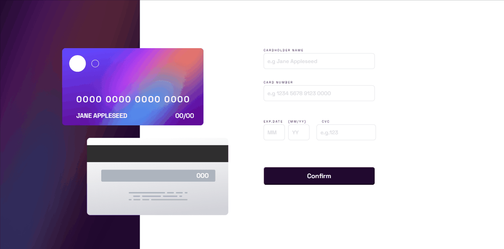
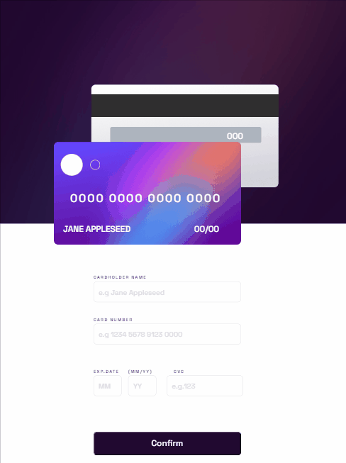
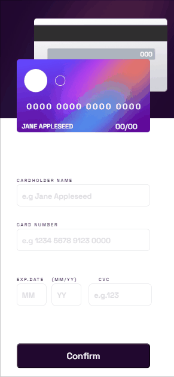

# Interactive-Card
Este desafio foi retirado do site Frontend Mentor.   [Clique aqui](https://www.frontendmentor.io/challenges/interactive-card-details-form-XpS8cKZDWw) para conferir o desafio.

## Do que se trata esse desafio?
Trata-se de um formulário,com preenchimento de forma dinâmica no cartão de crédito.
O usuário ao preencher os campos do formulário, pode conferir os dados sendo inseridos dinamicamente no cartão ao lado.

## Quais validações devem ser feitas?

Em cada campo do input existem validações,como:
- Não é permitido enviar campos em branco.
- Número mínimo e número máximo de caracteres.
- Campo que só aceita numeros.
- Campo que valida os meses do ano, sendo obrigatório preencher de 01 à 12.

## Habilidades desenvolvidas:
- Uso de tags semânticas para construção do formulário.
- Uso de flexbox para ajustes dos elementos na tela.
- Uso e manipulação dos elementos no JavaScript através do DOM.
- Uso de funções, eventos e condicionais para o dinamismo na tela.
- Uso de regex/máscara.
- Uso de mediaqueries para responsividade.

## Linguagens Utilizadas:
- HTML 

- CSS  

- Javascript  
          

## Veja como ficou:

### Desktop:

### Tablet:

 
### Mobile:
 

Para ver o projeto pronto, [clique aqui!](https://jessica-os.github.io/Interactive-Card/)
