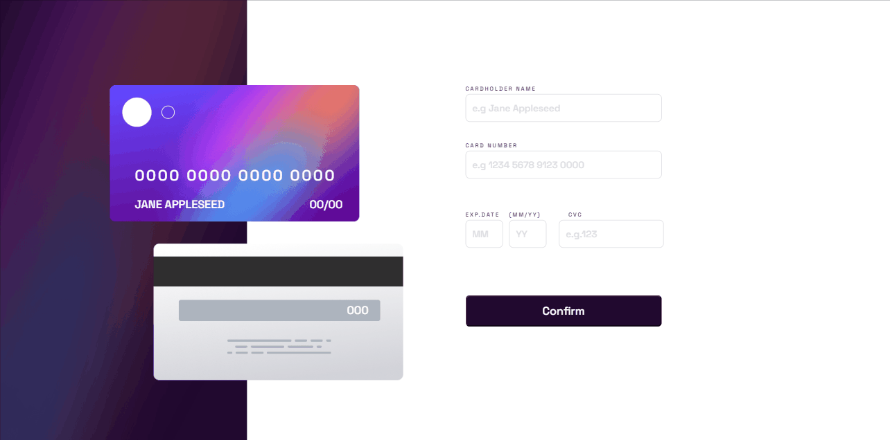
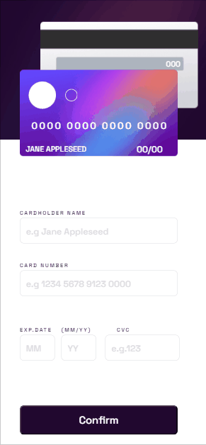

# 💳 Interactive Card Form

[](https://developer.mozilla.org/en-US/docs/Web/HTML)
[](https://developer.mozilla.org/en-US/docs/Web/CSS)
[](https://developer.mozilla.org/en-US/docs/Web/JavaScript)
[](https://robotframework.org/)
[](https://github.com/jessica-os/Interactive-Card/actions)

> Este desafio foi proposto pela [Frontend Mentor](https://www.frontendmentor.io/challenges/interactive-card-details-form-XpS8cKZDWw).  
> Confira a proposta original clicando [aqui](https://www.frontendmentor.io/challenges/interactive-card-details-form-XpS8cKZDWw).

---

## 📝 Sobre o Projeto

Trata-se de um formulário com preenchimento dinâmico de dados em um cartão de crédito fictício.  
À medida que o usuário insere os dados nos campos do formulário, eles são exibidos visualmente no cartão ao lado, em tempo real.

---

## ✅ Validações do Formulário

O formulário aplica validações importantes para garantir o preenchimento correto:

- ❌ Não permite envio de **campos em branco**
- 🔢 Validação de **número mínimo/máximo de caracteres**
- 🧮 Campos que aceitam **somente números**
- 📅 Validação de **mês entre 01 e 12**

---

## 🧠 Habilidades Desenvolvidas

- Uso de **tags semânticas** para estruturação do HTML
- Aplicação de **Flexbox** para responsividade
- Manipulação do DOM com **JavaScript**
- Implementação de **validações com Regex**
- Responsividade com **Media Queries**
- Boas práticas com código limpo e modular

---

## 💻 Tecnologias Utilizadas

<div style="display: flex; gap: 10px;">
  
  
  
</div>

---

## 🤖 Testes Automatizados com Robot Framework

Este projeto conta com uma suíte de **testes automatizados end-to-end** utilizando o [Robot Framework](https://robotframework.org/), com a biblioteca [Browser](https://robotframework-browser.org/) (baseada em Playwright) e a `FakerLibrary` para geração de dados dinâmicos.

### 🔍 O que está sendo testado?

- ✅ Envio com dados válidos
- ❌ Envio com campos em branco
- ✍️ Validação do campo Nome (apenas letras e espaços)
- 💳 Validação do Número do Cartão (exatamente 16 dígitos)
- 📅 Validação da Data (mês entre 01-12 e ano futuro)
- 🔒 Validação do CVC (3 dígitos numéricos)

### 🚀 Como rodar os testes localmente?

```bash
# Instale as dependências
pip install robotframework robotframework-browser FakerLibrary
rfbrowser init

# Suba o servidor local
npx http-server ./ -p 5501

# Execute os testes
robot -d results tests
```
📸 Veja como ficou!<br>
---
💻 Desktop<br>

---
📱 Tablet<br>

---
📲 Mobile<br>

---

🔗 Acesse o projeto<br>
👉 [Clique aqui para visualizar o projeto ao vivo!](https://jessica-os.github.io/Interactive-Card/)


